# Phase II: Design Report 

## Introduction

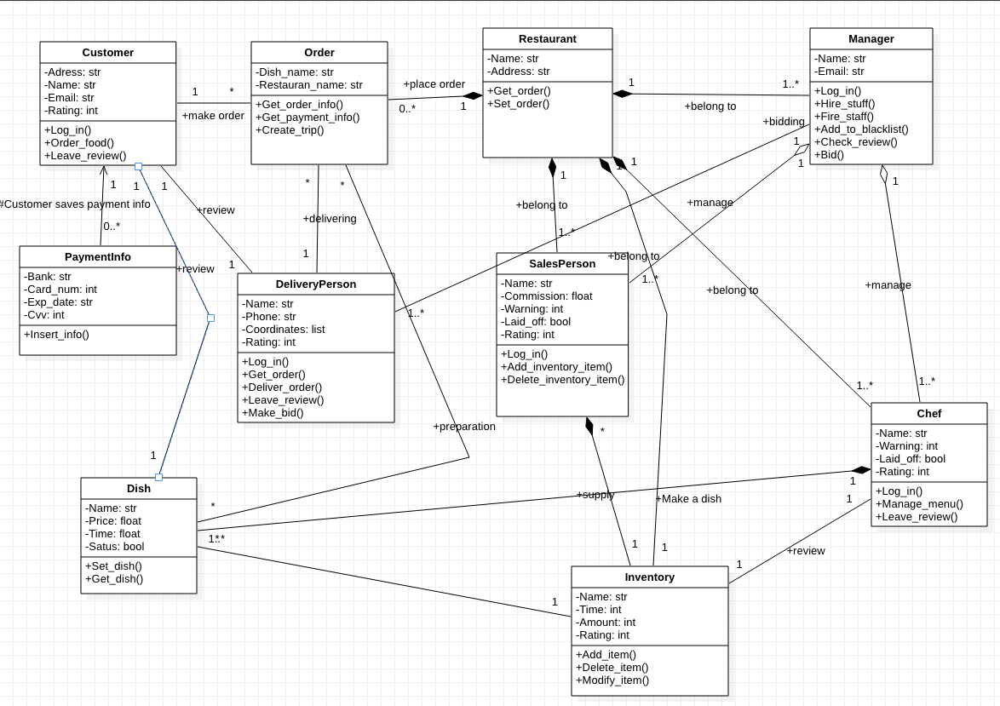

## Use cases

**Scenarios for each use case: normal AND exceptional scenarios**

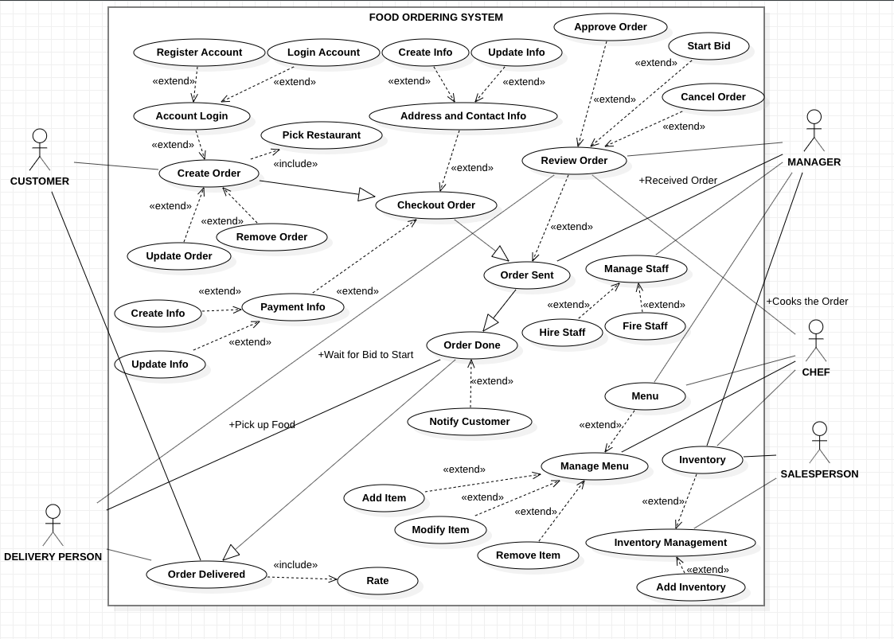

**Collaboration class diagram for each use case**

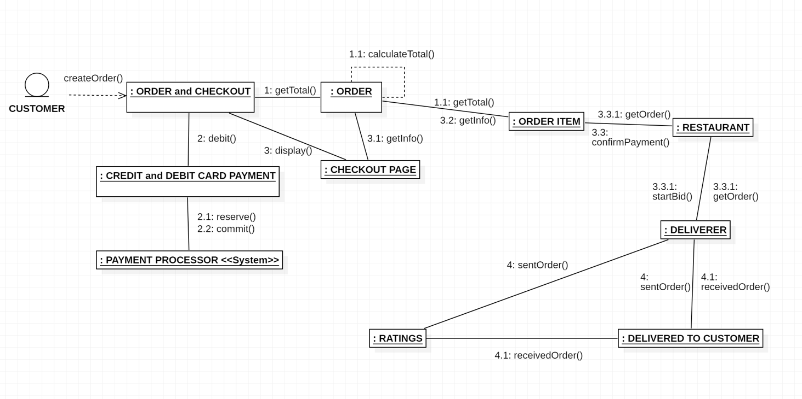

**State Diagram**

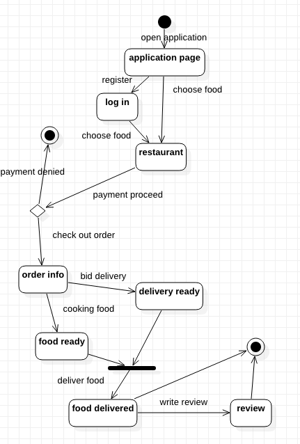

## E-R Diagram

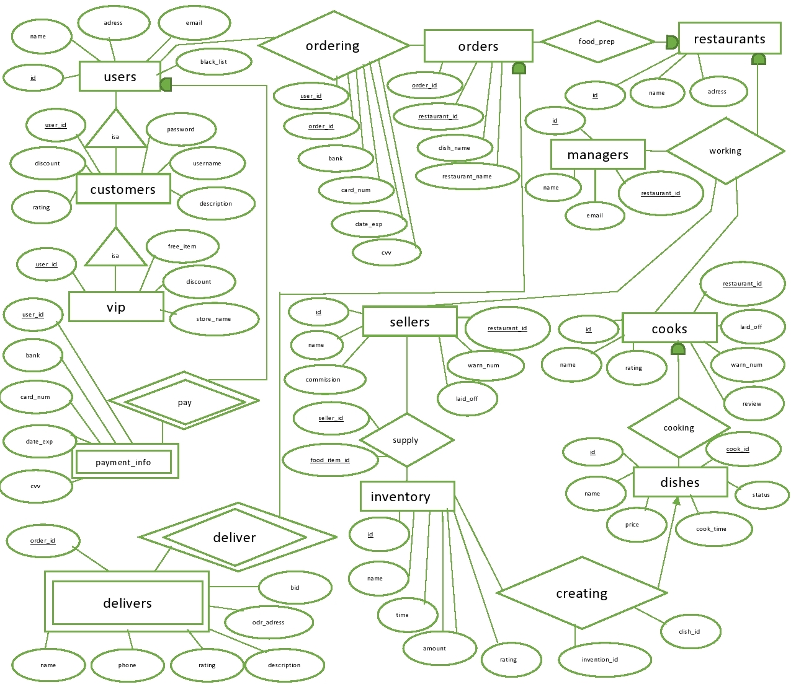

## Detailed Design

**Methods:**

`order_item(cust_id, authentication_token, item_id, cc_info)`

**Input:** The front end will send the id of the customer and will also provide an authentication token to verify his identity. The id of the dish the customer wishes to order will also be provided

**Output:** This method will output the order ID if it was placed successfully. A successful order requires valid authentication, valid inputs for all fields, and a successful transaction using the given credit card. A number of error codes will be sent back if the order failed:

 * 400 – Invalid cust_id or item_id
 * 401 – User failed to authenticate
 * 404 – Server is currently offline

`rate_dish(authentication_token, order_id, rating, review_text)`

**Input:** An authentication token must be provided to authenticate the reviewer. The order id contains all the data needed to find the item. It includes: customer id, item id, and time of delivery. Finally, the customer must provide a rating (1-5) and optional review text.

**Output:** This function will return whether or not the review was successfully submitted. A valid review requires: 

* Rating between 1-5 inclusive
* Valid order id
* Valid authentication token for the customer specified in the order id
* Review text must not be blank or null if the user rates 3 or below.

`bid_order(authentication_token, order_id, bid)`

**Input:** An authenticated deliverer will bid on a specific order. Authentication, order id, and bid price must be provided

**Output:** This function will return a boolean value to signify whether the bid went through successfully. A successful bid requires proper authentication, an order to bid on, and a price which is lower than the current lowest bid. 

`make_payment(authentication_token ,cc_info, order_id)`

**Input:** Credit card information is mandatory for making a payment. The order id will determine to which restaurant the payment goes to, how much will be paid, and which order we will pay for. Both must be valid.

**Output:** This function will call upon an external payment system to process this payment. Should the payment be successful, the function will return true. This function will be called by place_order.

`add_cook(authentication_token, restaurant_id, name)`

**Input:** The manager authenticates himself and then adds a new cook to the restaurant. His name will have to be provided.

**Output:** If everything is valid, the given name will be registered as a cook for the given restaurant. The function will return the cook’s ID.

A similar function add_seller will be used to add sellers. The only difference between add seller and add cook is that add seller will instead add the name to a list of sellers.

`add_dish(authentication_token, cook, dish_name, dish_description dish_price)`

**Input:** The cook will have to authenticate himself and then provide a dish name, a dish price, and a description.

**Output:** The given dish will be added to the database and will be available for customers to buy.

`fire_cook(authentication_token,cook_id)`

**Input:** A manager will provide his authentication token along with the id of the cook he wishes to fire.

**Output:** The cook will be marked as fired and will lose his ability to add dishes. All of his dishes will be removed from listings and marked as invalid.

register(id, email, password)

**Input:**  A vald email address and a proper password should be provided. 

**Output:** The user will have a pending registration if the email and password are valid. After a manager approves his registration, he will receive an email confirming that he is registered.

`verify_registration(auth_token, manager_id, cust_id)`

**Input:**  A manager should validate himself with his token + id and provide a customer id.

**Output:** The given customer, if he is unverified, will be marked as verified and his account will be successfully registered.

`change_address(cust_id, cust_password, new_address)`

**Input:**  Customer inputs his credentials with a new address.

**Output:** The customer's address will be changed.

`add_credit_card(cust_id, cust_password, new_address)`

**Input:**  Customer inputs his credentials  alongwith a  credit card.

**Output:** The credit card is registered to the customer.

`mark_as_ready(auth_token, cook_id, order_id)`

**Input:**  Cook verifies himself and then marks an order as cooked and ready for delivery

**Output:** The item is marked as ready for the delivery person.

`mark_as_delivered(auth_token, cook_id, order_id)`

**Input:**  Deliverer verifies himself and then marks an order as delivered

**Output:** The item is marked as delivered.

## System Screens

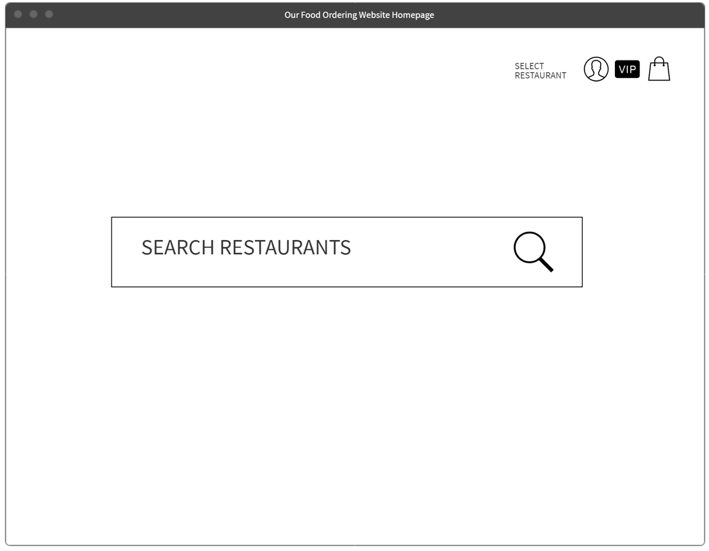

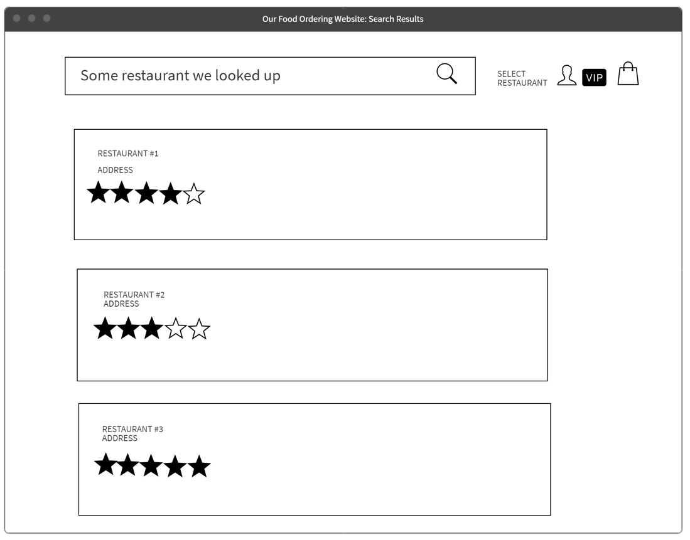

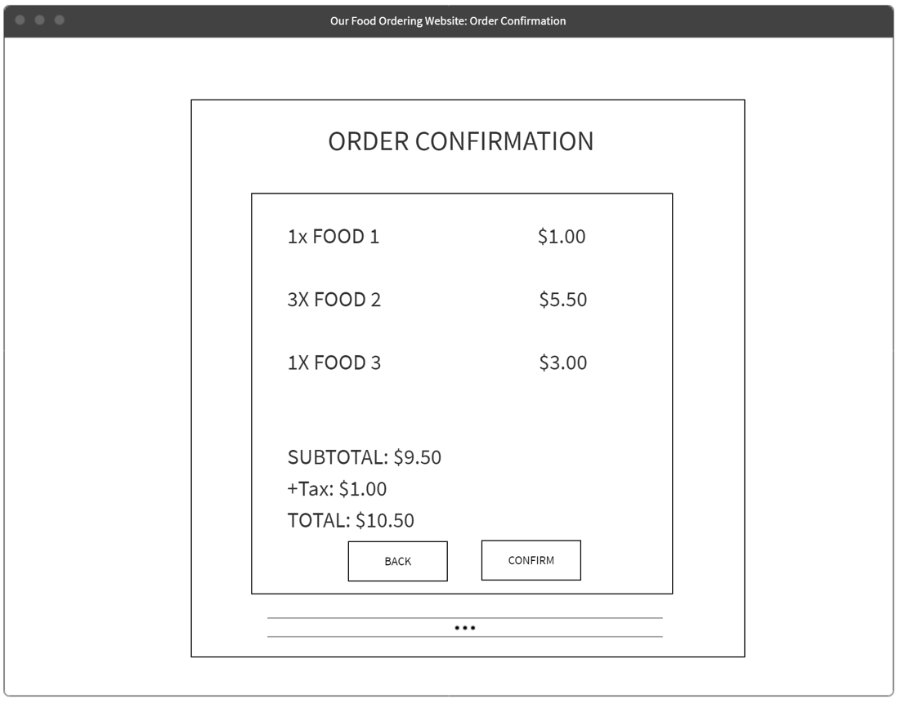

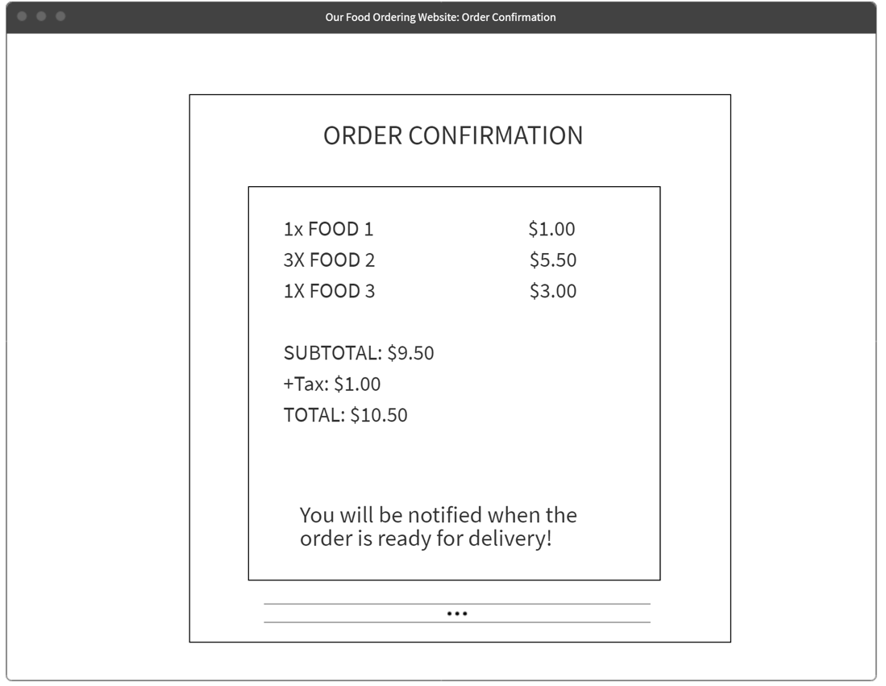

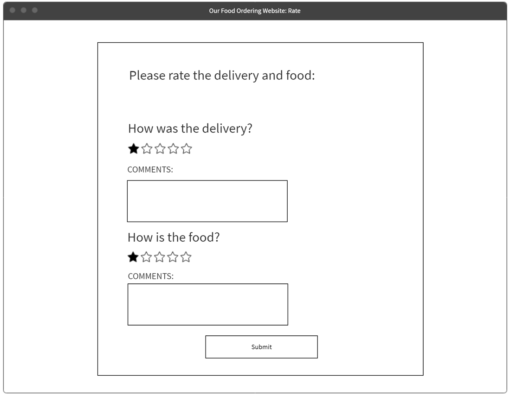

**FOR RESTAURANT**

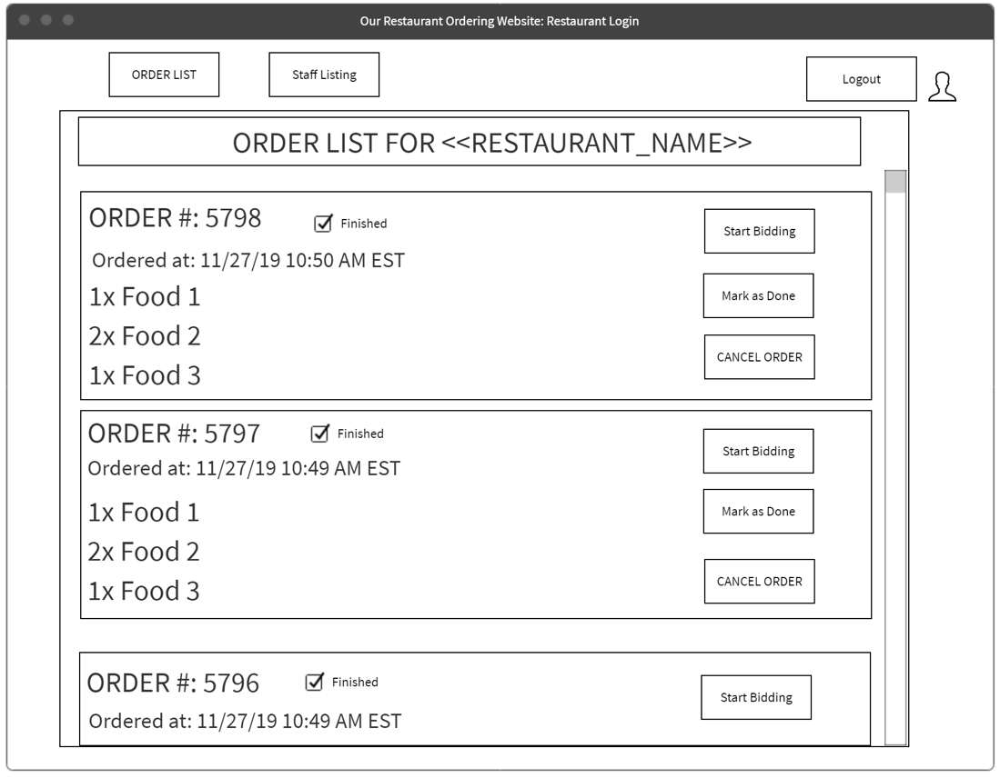
